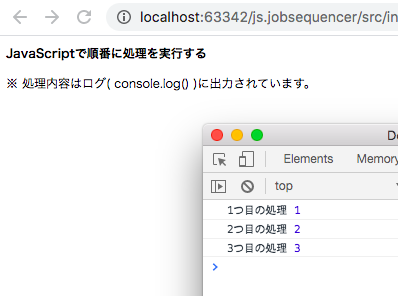

# js.jobsequencer
jobsequencerライブラリを使ってみる。  
※ bitbucketのmercurialのサポート終了に伴い、githubへ移植する  
※ 割と昔のコードです  

## サンプル

## 参考文献
* [javascript 追加した関数を順次実行するためのJobSequencerというのを書いてみた](http://blog.iss.ms/2011/12/29/164513)
* [jobsequencer.js — Gist](https://gist.github.com/1532557)
  
